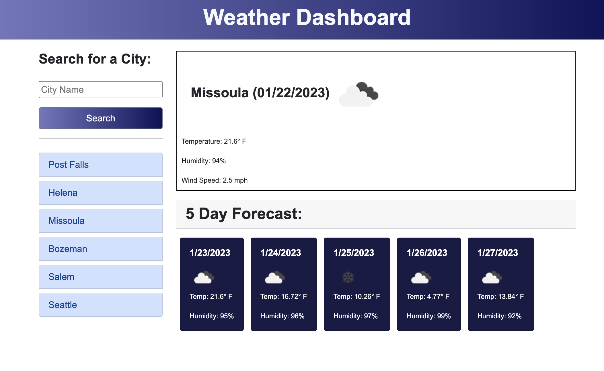

# 06-weather-dashboard
Server Side API by Mariah Wear
Due Jan 25th, 2023

## Mock-Up

The following image shows the web application's appearance and functionality:



## Deployed Project
https://mariahw4.github.io/06-weather-dashboard/

## Your Task

The task was to familiarize ourself with using a third-party API. Our challenge was to build a weather dashboard that runs in the browser and features dynamically updated HTML and CSS.

## User Story (from source)

```
AS A traveler
I WANT to see the weather outlook for multiple cities
SO THAT I can plan a trip accordingly
```

## Acceptance Criteria (from source)

```
GIVEN a weather dashboard with form inputs
WHEN I search for a city
THEN I am presented with current and future conditions for that city and that city is added to the search history
WHEN I view current weather conditions for that city
THEN I am presented with the city name, the date, an icon representation of weather conditions, the temperature, the humidity, and the wind speed
WHEN I view future weather conditions for that city
THEN I am presented with a 5-day forecast that displays the date, an icon representation of weather conditions, the temperature, the wind speed, and the humidity
WHEN I click on a city in the search history
THEN I am again presented with current and future conditions for that city
```


© 2022 edX Boot Camps LLC. Confidential and Proprietary. All Rights Reserved.
